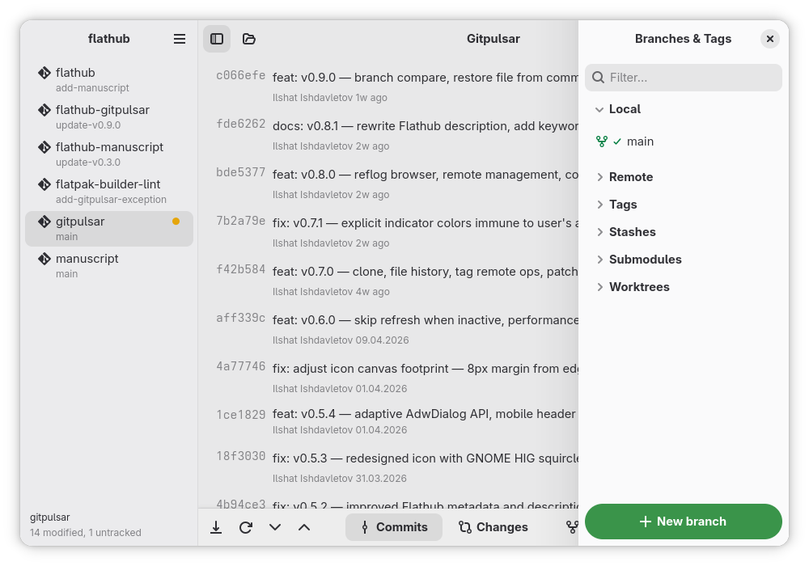
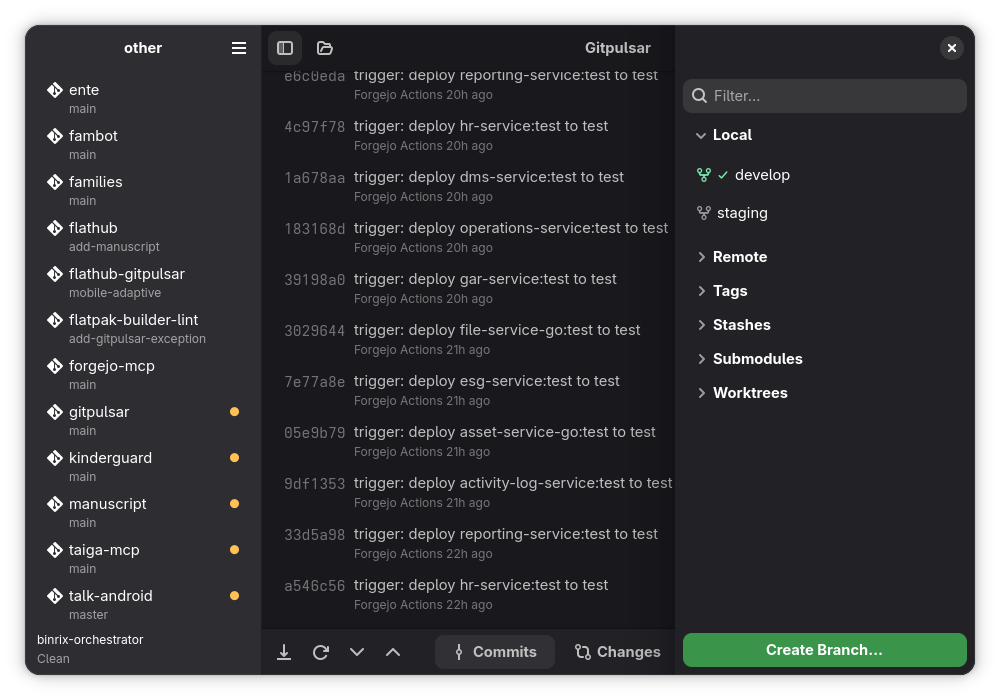

# Gitpanel

**A fast, native Git client for GNOME.** Written in Rust with GTK4 and libadwaita — small binary, low memory, no telemetry, no cloud, no terminal required.




## Why Gitpanel

- **Native GNOME experience** — libadwaita widgets, dark/light themes, follows your accent color
- **Multi-repository workspace** — open a folder, see every repo with live status indicators (modified, untracked, ahead of remote)
- **Adaptive layout** — runs from 4K monitors down to 360 px phone screens (Phosh, postmarketOS)
- **Lightweight** — Rust core with background polling that pauses when the window is not focused
- **Privacy-first** — no telemetry, no account, no cloud sync; everything stays local
- **Complete workflow** — staging, hunks, conflict editor, interactive rebase, blame, reflog, patches, remotes, submodules, worktrees, stashes, tags

## Features

- **Clone repository** — clone from URL with a built-in dialog
- **Multi-repo workspace** — open a folder, browse all Git repositories inside
- **Commit history** — searchable list with expandable details, paginated loading
- **Commit detail** — prominent message display, file list with configurable limit, collapsible technical details
- **Branch graph** — visual branch topology in a separate window
- **Staging area** — unified list with staged files pinned to the top (bold) and a green check next to staged entries; per-file and per-hunk stage/unstage/discard
- **Partial staging** — stage/unstage individual hunks within a file
- **Syntax highlighting** — language-aware diff coloring with dark/light theme support
- **Undo/redo** — undo staging operations and file discards (Ctrl+Z / Ctrl+Shift+Z)
- **Branch management** — create, checkout local/remote branches
- **Remote operations** — fetch, pull, push via git CLI (reliable SSH support)
- **Stash** — save, pop, list, drop
- **Commit editing** — amend, edit message, cherry-pick, revert
- **Commit signing** — signed commit indicator (lock icon)
- **Merge & rebase** — conflict detection, continue/abort merge and rebase
- **Interactive rebase** — reorder, squash, fixup, reword, drop commits
- **Submodules** — list, init, update submodules
- **Worktrees** — list, add, remove git worktrees
- **.gitignore editor** — edit .gitignore from the app menu
- **Reflog browser** — recover from accidental reset/rebase via HEAD reflog
- **Remote management** — add/remove/rename remotes and edit URLs via dialog
- **Co-Author helper** — add `Co-Authored-By` trailer with a popover button
- **Branch compare** — diff between any two refs from a dialog
- **Restore file from commit** — bring back a single file from history
- **Word-level diff** — intra-line emphasis on what actually changed
- **Bisect** — interactive `git bisect` driven from a banner (Good / Bad / Skip / Reset)
- **Archive export** — `git archive` any commit to `tar.gz`, `tar`, or `zip`
- **Branch graph export** — save the commit graph as a PNG image
- **File history** — per-file commit log via the history button on each file row
- **Tag remote operations** — right-click tag: push to remote, delete from remote, delete locally
- **Patch import/export** — export a commit as a `.patch` file or apply an existing patch (`git am` + `git apply` fallback)
- **Adaptive layout** — 4-tier responsive design backed by `AdwOverlaySplitView` so sidebars overlay content with an edge-swipe gesture on phone widths, plus an `AdwViewSwitcherBar` that surfaces on narrow widths. Breakpoints at 1080 sp / 860 sp / 600 sp / 500 sp. Minimum 360 px width.
- **Open in your editor** — launch the current repository in VS Code, Zed, GNOME Builder, a JetBrains IDE or any custom command (Ctrl+Shift+O)
- **Auto-refresh** — configurable polling with hash-based skip
- **Preferences** — date format, refresh interval, commit files limit, external editor

## Usage

### Getting started

Open a workspace folder or a single Git repository:

```sh
gitpanel /path/to/projects   # open a folder with multiple repos
gitpanel /path/to/repo       # open a single repository
```

Or use **Ctrl+O** inside the app to open a folder. If the folder contains multiple Git repositories, they appear in the left sidebar. Click a repository to select it.

### Repository indicators

Each repository in the sidebar shows colored dots to the right of its name (hover for tooltip):

- **● green** — unpushed commits ahead of remote
- **● yellow** — uncommitted changes in tracked files (modified, staged, deleted)
- **● blue** — only untracked files (new files not yet added)

### Working with changes

1. Switch to the **Changes** tab (Ctrl+2) — staged files appear at the top (bold, green check), unstaged below.
2. Click a file to expand its inline diff with syntax highlighting.
3. Use the **+** button to stage, **−** to unstage, **🗑** to discard.
4. For multi-hunk files, use **Stage Hunk** buttons to stage individual hunks.
5. Use **Stage All** / **Unstage All** buttons or Ctrl+Shift+S / Ctrl+Shift+U.
6. Type a commit message and press **Commit** (Ctrl+Enter). Empty commits are rejected unless you tick **Allow empty**.
7. Mistakes? **Ctrl+Z** undoes staging operations, even file discards.

### Browsing history

The **Commits** tab (Ctrl+1) shows the commit log with expandable details:
- Click a commit to see the full message (prominently displayed), changed files, and collapsible technical details (SHA, parent, author, date).
- Scroll to the bottom and click **Load more commits** for older history.
- Signed commits show a lock icon.

### Remote operations

- **Fetch** (Ctrl+Shift+F), **Pull** (Ctrl+Shift+L), **Push** (Ctrl+Shift+P)
- Force push is available from the hamburger menu.

### Other tools

- **Stash**: Ctrl+Alt+S to save, Ctrl+Alt+P to pop. Manage stashes in the right sidebar.
- **Branches & Tags**: Create, checkout, and search in the right sidebar panel.
- **.gitignore**: Edit from the hamburger menu (Menu → Edit .gitignore).
- **Preferences**: Date format, auto-refresh interval, commit files limit, external editor.

### Opening the repository in an editor

Pick your editor once in **Preferences → External Tools → Open with**. Gitpanel
scans for the editors it knows about — VS Code, VSCodium, Cursor, Windsurf, Zed,
GNOME Builder, Kate, KDevelop, Sublime Text, Qt Creator, Emacs, Android Studio
and the JetBrains IDEs — and lists whichever are installed. Anything else goes
under **Custom command**.

The menu entry then reads **Open in Zed** (or whichever you chose) and is bound
to **Ctrl+Shift+O**.

A custom command receives the repository path as its final argument. If the path
belongs somewhere else, put `{path}` where it should go:

```
myeditor --workspace {path} --no-splash
```

Editors installed as Flatpaks are found under their application ID.

**In the Flatpak build this works differently.** Flathub does not permit the
sandbox permission needed to start an application on the host, so there is
nothing to configure: the menu entry reads **Open With…** and asks the system
which application should open the repository. Your choice is remembered by the
desktop portal.

That chooser only lists applications registering as handlers for
`inode/directory`. VS Code, VSCodium, Kate, IntelliJ IDEA and Android Studio
do; Zed, GNOME Builder, Qt Creator and Emacs do not, and will not appear. That
is set by each application's own desktop entry and cannot be changed from here
— Zed, for instance, ships the line commented out deliberately. If your editor
is missing, the AppImage and distribution packages launch it directly.

## Architecture

```
crates/
├── gitpanel/        # Git operations library (git2-rs + git CLI)
│   ├── repository.rs      # Repo open, status, log (paginated), branches, ahead/behind
│   ├── staging.rs          # Stage, unstage, commit, discard, hunk-level staging
│   ├── remote.rs           # Fetch, pull, push (git2 for local, CLI for remote)
│   ├── branch.rs           # Checkout, create branches
│   ├── diff.rs             # Commit, staged, unstaged diffs
│   ├── stash.rs            # Stash save, pop, list, drop
│   ├── workspace.rs        # Multi-repo workspace scanning (parallel)
│   ├── merge.rs            # Conflict detection, continue/abort merge & rebase
│   ├── rebase.rs           # Interactive rebase via GIT_SEQUENCE_EDITOR
│   ├── submodules.rs       # Submodule list, init, update
│   ├── worktrees.rs        # Worktree list, add, remove
│   ├── gitignore.rs        # Read/write .gitignore
│   └── models.rs           # Data types (CommitInfo, BranchInfo, DiffFile, etc.)
└── gitpanel/          # GTK4 + libadwaita frontend
    ├── app.rs              # Application setup + keyboard shortcuts
    ├── main.rs             # Entry point
    ├── config.rs           # Preferences (date format, refresh interval, files limit)
    ├── undo.rs             # Undo/redo stack for staging operations
    └── widgets/
        ├── window.rs              # Main window, layout, actions, state
        ├── commit_list.rs         # Expandable commit rows with new layout
        ├── commit_graph.rs        # Branch graph (cairo rendering)
        ├── changes_view.rs        # Split staged/unstaged lists, DnD, hunk actions
        ├── branches_tags_panel.rs # Right sidebar (branches, remotes, tags, stashes)
        ├── repo_tree.rs           # Repository tree with indicators
        ├── preferences_dialog.rs  # Settings dialog
        ├── gitignore_editor.rs    # .gitignore editor dialog
        └── syntax.rs              # Syntax highlighting via syntect
```

Core is a standalone library with no UI dependencies, designed for pluggable frontends.

## Keyboard Shortcuts

| Shortcut | Action |
|---|---|
| Ctrl+O | Open workspace/repo |
| Ctrl+Shift+O | Open repo in external editor |
| Ctrl+Enter | Commit |
| Ctrl+Shift+S | Stage all |
| Ctrl+Shift+U | Unstage all |
| Ctrl+Z | Undo |
| Ctrl+Shift+Z | Redo |
| Ctrl+Shift+F | Fetch |
| Ctrl+Shift+P | Push |
| Ctrl+Shift+L | Pull |
| Ctrl+1 | Show commits |
| Ctrl+2 | Show changes |
| Ctrl+F | Focus search |
| Ctrl+Alt+S | Stash save |
| Ctrl+Alt+P | Stash pop |
| Ctrl+Q | Quit |

## Environment variables

| Variable | Effect |
|---|---|
| `GP_WIDTH` | Initial window width in pixels (default 1200) |
| `GP_HEIGHT` | Initial window height in pixels (default 800) |
| `GP_SIMULATE_FLATPAK` | Set to `1` to behave as the Flatpak build does ("Open with" goes through the desktop portal) |

## Logging

Gitpanel is privacy-first — logs never leave the machine. They are written to a
size-rotating file in your data directory:
`~/.local/share/io.github.liangzhaoyuan12/logs/gitpanel.log` (plus
`gitpanel.log.1` … `gitpanel.log.5` backups of 2 MiB each). Every
`tracing` call in the code is captured there.

| Variable | Effect |
|---|---|
| `GP_LOG_DIR` | Override the log directory |
| `GP_LOG_LEVEL` | Minimum level: `trace` / `debug` / `info` / `warn` / `error` |
| `GP_LOG_STDOUT` | Set to `1` to also mirror logs to stdout (useful when running from a terminal) |
| `RUST_LOG` | Standard `tracing` filter; takes precedence over `GP_LOG_LEVEL` when set |

## Requirements

- Rust 1.70+
- GTK 4.12+
- libadwaita 1.5+
- git (for remote operations)

### Fedora

```sh
sudo dnf install gtk4-devel libadwaita-devel
```

### Ubuntu / Debian

```sh
sudo apt install libgtk-4-dev libadwaita-1-dev
```

### Arch Linux

```sh
sudo pacman -S gtk4 libadwaita
```

## Install

```sh
make install   # builds release and installs to ~/.local
```

This installs the binary, desktop entry, icon, and metainfo.

## Building

```sh
cargo build --release
```

## Running

```sh
gitpanel
```

Or from source:

```sh
cargo run -p gitpanel
```

## Uninstall

```sh
make uninstall
```

## Documentation

- [User Guide (English)](docs/guide-en.md)
- [Руководство пользователя (Русский)](docs/guide-ru.md)

## Contributing

Bug reports and merge requests are welcome — see [CONTRIBUTING.md](CONTRIBUTING.md)
for the build setup, the quality gate, and how to run the widget tests headless.

## Thanks

- [Iyaan Azeez](https://gitlab.com/gxhamster) — fixed the commit message field
  swallowing clicks on its placeholder

## License

GPL-3.0-or-later
