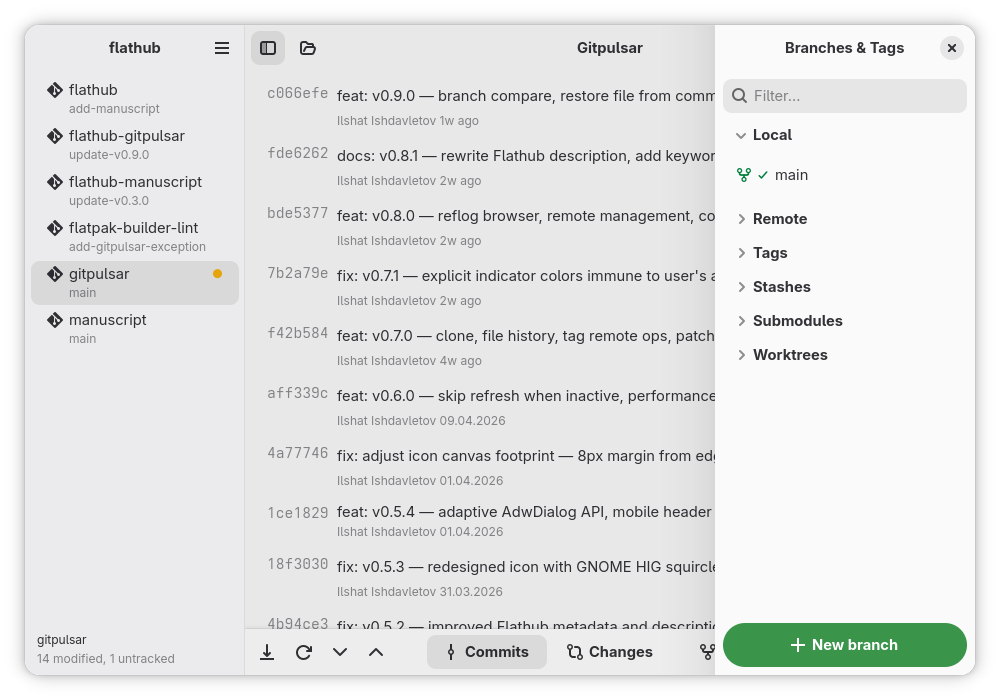
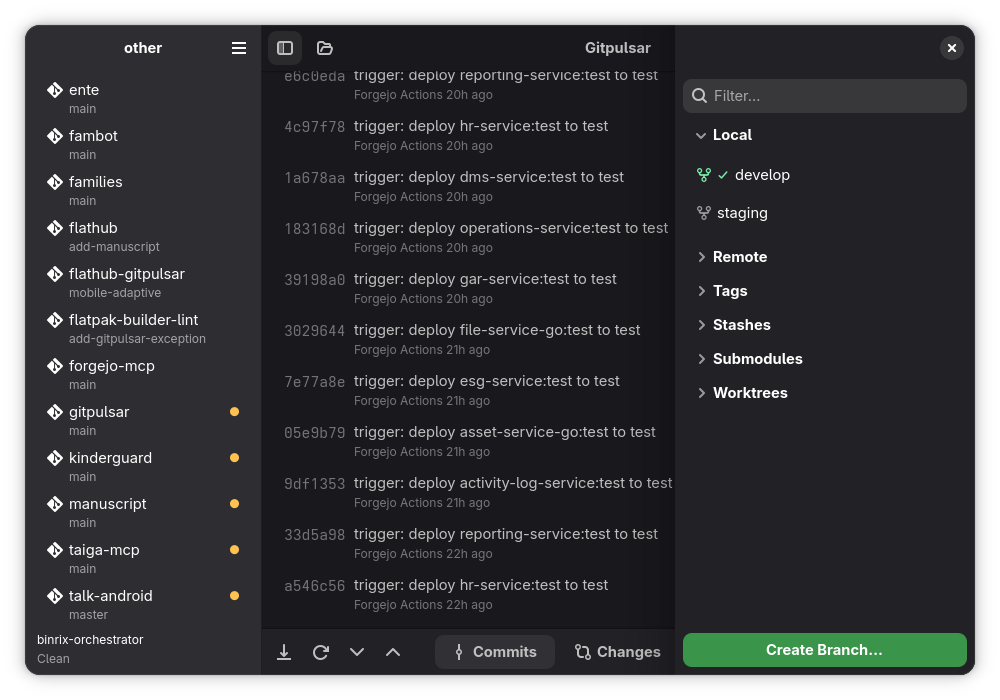

# Gitpanel

[English](README.md) | [简体中文](README.zh-CN.md)

**一款快速、原生的 GNOME Git 客户端。** 使用 Rust + GTK4 + libadwaita 编写 —— 体积小、内存占用低、无遥测、无云端、无需终端。




## 下载

Gitpanel 已上架微软商店（Microsoft Store）：

<a href="https://get.microsoft.com/installer/download/9P5JLDQSM5S2?referrer=appbadge" target="_self" >
  
</a>

> **Windows 用户请注意：** Release 不再对 Windows 进行分发，请前往微软商店下载 Gitpanel。

## 为什么选择 Gitpanel

- **原生 GNOME 体验** —— libadwaita 控件、亮/暗主题、跟随系统强调色
- **多仓库工作区** —— 打开一个文件夹即可看到其中所有仓库，并有实时状态指示（已修改、未跟踪、领先远端）
- **自适应布局** —— 从 4K 显示器到 360 px 手机屏幕都能运行（Phosh、postmarketOS）
- **轻量** —— Rust 内核，窗口失焦时后台轮询自动暂停
- **隐私优先** —— 无遥测、无账号、无云同步；一切数据留在本地
- **完整工作流** —— 暂存、按块暂存、冲突编辑器、交互式 rebase、blame、reflog、补丁、远端、子模块、worktree、stash、标签

## 功能特性

- **克隆仓库** —— 通过内置对话框从 URL 克隆
- **多仓库工作区** —— 打开一个文件夹，浏览其中所有 Git 仓库
- **提交历史** —— 可搜索列表、可展开详情、分页加载
- **提交详情** —— 醒目的提交信息展示、文件列表（数量可配置）、可折叠的技术细节
- **分支图** —— 独立窗口展示可视化分支拓扑
- **暂存区** —— 统一列表，已暂存文件置顶（加粗）并带绿色对勾；支持按文件和按 hunk 的暂存 / 取消暂存 / 丢弃
- **部分暂存** —— 对文件内的单个 hunk 进行暂存或取消暂存
- **语法高亮** —— 语言感知的 diff 着色，支持亮/暗主题
- **撤销 / 重做** —— 撤销暂存操作与文件丢弃（Ctrl+Z / Ctrl+Shift+Z）
- **分支管理** —— 创建、切换本地及远程分支
- **远端操作** —— fetch、pull、push 走 git CLI（SSH 支持可靠）
- **Stash** —— 保存、弹出、列出、丢弃
- **提交编辑** —— amend、修改信息、cherry-pick、revert
- **提交签名** —— 已签名提交标识（锁形图标）
- **合并与 rebase** —— 冲突检测、继续 / 中止合并与 rebase
- **交互式 rebase** —— 重排、squash、fixup、reword、丢弃提交
- **子模块** —— 列出、init、update 子模块
- **Worktree** —— 列出、添加、移除 git worktree
- **.gitignore 编辑器** —— 从应用菜单编辑 .gitignore
- **Reflog 浏览器** —— 通过 HEAD reflog 从误操作的 reset / rebase 中恢复
- **远端管理** —— 通过对话框添加 / 删除 / 重命名远端并编辑 URL
- **Co-Author 助手** —— 用 popover 按钮添加 `Co-Authored-By` 尾注
- **分支比较** —— 从对话框选择任意两个 ref 进行 diff
- **从提交恢复文件** —— 从历史中找回单个文件
- **词级 diff** —— 行内标注真正变化的内容
- **Bisect** —— 通过横幅交互式驱动 `git bisect`（Good / Bad / Skip / Reset）
- **归档导出** —— 将任意提交导出为 `tar.gz`、`tar` 或 `zip`
- **分支图导出** —— 将提交图保存为 PNG 图片
- **文件历史** —— 通过每行文件旁的历史按钮查看单文件提交日志
- **标签远端操作** —— 右键标签：推送到远端、从远端删除、本地删除
- **补丁导入 / 导出** —— 导出提交为 `.patch` 文件，或应用已有补丁（`git am` + `git apply` 兜底）
- **自适应布局** —— 4 级响应式设计，基于 `AdwOverlaySplitView`，窄屏下侧边栏以边缘滑动手势覆盖内容，并配合 `AdwViewSwitcherBar`。断点为 1080 sp / 860 sp / 600 sp / 500 sp，最小宽度 360 px。
- **在编辑器中打开** —— 用 VS Code、Zed、GNOME Builder、JetBrains IDE 或任意自定义命令打开当前仓库（Ctrl+Shift+O）
- **自动刷新** —— 可配置轮询，基于 hash 跳过无变化的刷新
- **偏好设置** —— 日期格式、刷新间隔、提交文件数上限、外部编辑器

## 使用说明

### 快速开始

打开一个工作区文件夹或单个 Git 仓库：

```sh
gitpanel /path/to/projects   # 打开包含多个仓库的文件夹
gitpanel /path/to/repo       # 打开单个仓库
```

也可以在应用内按 **Ctrl+O** 打开文件夹。如果该文件夹包含多个 Git 仓库，它们会显示在左侧边栏，点击即可选中。

### 仓库状态指示

侧边栏中每个仓库名称右侧都有彩色圆点（悬停可见提示）：

- **● 绿色** —— 有未推送、领先远端的提交
- **● 黄色** —— 已跟踪文件有未提交的改动（修改、暂存、删除）
- **● 蓝色** —— 只有未跟踪文件（尚未添加的新文件）

### 处理改动

1. 切到 **Changes** 标签页（Ctrl+2）—— 已暂存文件在顶部（加粗、绿色对勾），未暂存在下方。
2. 点击文件展开内联 diff，带语法高亮。
3. 用 **+** 暂存，**−** 取消暂存，**🗑** 丢弃。
4. 多 hunk 文件可用 **Stage Hunk** 按钮单独暂存某个 hunk。
5. 使用 **Stage All** / **Unstage All** 按钮，或 Ctrl+Shift+S / Ctrl+Shift+U。
6. 输入提交信息后按 **Commit**（Ctrl+Enter）。除非勾选 **Allow empty**，否则不允许空提交。
7. 搞错了？**Ctrl+Z** 可撤销暂存操作，甚至撤销文件丢弃。

### 浏览历史

**Commits** 标签页（Ctrl+1）展示提交日志，可展开详情：
- 点击提交查看完整信息（醒目展示）、变更文件，以及可折叠的技术细节（SHA、父提交、作者、日期）。
- 滚动到底部点击 **Load more commits** 加载更早的历史。
- 已签名的提交显示锁形图标。

### 远端操作

- **Fetch**（Ctrl+Shift+F）、**Pull**（Ctrl+Shift+L）、**Push**（Ctrl+Shift+P）
- 强制推送在汉堡菜单中。

### 其他工具

- **Stash**：Ctrl+Alt+S 保存，Ctrl+Alt+P 弹出。在右侧边栏管理 stash。
- **分支与标签**：在右侧面板创建、切换、搜索。
- **.gitignore**：从汉堡菜单编辑（菜单 → Edit .gitignore）。
- **偏好设置**：日期格式、自动刷新间隔、提交文件数上限、外部编辑器。

### 在编辑器中打开仓库

先在 **Preferences → External Tools → Open with** 中选择一次编辑器。Gitpanel
会扫描它认识的编辑器 —— VS Code、VSCodium、Cursor、Windsurf、Zed、GNOME
Builder、Kate、KDevelop、Sublime Text、Qt Creator、Emacs、Android Studio
以及 JetBrains 系列 IDE —— 并列出已安装的。其他情况放在 **Custom command**。

菜单项随后会显示为 **Open in Zed**（或你选择的那个），绑定快捷键
**Ctrl+Shift+O**。

自定义命令会把仓库路径作为最后一个参数传入。如果路径不在末尾，用 `{path}`
占位：

```
myeditor --workspace {path} --no-splash
```

以 Flatpak 形式安装的编辑器会按其 application ID 被找到。

**Flatpak 构建的行为有所不同。** Flathub 不允许启动宿主机应用所需的沙箱权限，
所以这里无需配置：菜单项显示为 **Open With…**，交给系统决定用哪个应用打开
仓库。你的选择由桌面门户（desktop portal）记住。

该选择器只会列出注册为 `inode/directory` 处理器的应用。VS Code、VSCodium、
Kate、IntelliJ IDEA 和 Android Studio 可以；Zed、GNOME Builder、Qt Creator
和 Emacs 不行，因此不会出现。这是各应用自己的 desktop entry 决定的，无法从
这里修改 —— 例如 Zed 就是故意把那行注释掉的。如果你的编辑器不在列表中，
AppImage 和发行版包可以直接启动它。

## 架构

```
crates/
├── gitpanel/        # Git 操作库（git2-rs + git CLI）
│   ├── repository.rs      # 仓库打开、状态、日志（分页）、分支、领先/落后
│   ├── staging.rs          # 暂存、取消暂存、提交、丢弃、hunk 级暂存
│   ├── remote.rs           # fetch、pull、push（本地用 git2，远端用 CLI）
│   ├── branch.rs           # 切换、创建分支
│   ├── diff.rs             # 提交、已暂存、未暂存的 diff
│   ├── stash.rs            # stash 保存、弹出、列出、丢弃
│   ├── workspace.rs        # 多仓库工作区扫描（并行）
│   ├── merge.rs            # 冲突检测、继续/中止合并与 rebase
│   ├── rebase.rs           # 通过 GIT_SEQUENCE_EDITOR 实现交互式 rebase
│   ├── submodules.rs       # 子模块列出、init、update
│   ├── worktrees.rs        # worktree 列出、添加、移除
│   ├── gitignore.rs        # 读写 .gitignore
│   └── models.rs           # 数据类型（CommitInfo、BranchInfo、DiffFile 等）
└── gitpanel/          # GTK4 + libadwaita 前端
    ├── app.rs              # 应用初始化 + 快捷键
    ├── main.rs             # 入口
    ├── config.rs           # 偏好设置（日期格式、刷新间隔、文件数上限）
    ├── undo.rs             # 暂存操作的撤销/重做栈
    └── widgets/
        ├── window.rs              # 主窗口、布局、动作、状态
        ├── commit_list.rs         # 可展开的提交行（新布局）
        ├── commit_graph.rs        # 分支图（cairo 渲染）
        ├── changes_view.rs        # 已暂存/未暂存列表拆分、拖放、hunk 操作
        ├── branches_tags_panel.rs # 右侧边栏（分支、远端、标签、stash）
        ├── repo_tree.rs           # 带状态指示的仓库树
        ├── preferences_dialog.rs  # 设置对话框
        ├── gitignore_editor.rs    # .gitignore 编辑对话框
        └── syntax.rs              # 基于 syntect 的语法高亮
```

核心是一个无 UI 依赖的独立库，面向可插拔前端设计。

## 快捷键

| 快捷键 | 操作 |
|---|---|
| Ctrl+O | 打开工作区 / 仓库 |
| Ctrl+Shift+O | 在外部编辑器中打开仓库 |
| Ctrl+Enter | 提交 |
| Ctrl+Shift+S | 全部暂存 |
| Ctrl+Shift+U | 全部取消暂存 |
| Ctrl+Z | 撤销 |
| Ctrl+Shift+Z | 重做 |
| Ctrl+Shift+F | Fetch |
| Ctrl+Shift+P | Push |
| Ctrl+Shift+L | Pull |
| Ctrl+1 | 显示提交 |
| Ctrl+2 | 显示改动 |
| Ctrl+F | 聚焦搜索 |
| Ctrl+Alt+S | 保存 stash |
| Ctrl+Alt+P | 弹出 stash |
| Ctrl+Q | 退出 |

## 环境变量

| 变量 | 作用 |
|---|---|
| `GP_WIDTH` | 初始窗口宽度（像素，默认 1200） |
| `GP_HEIGHT` | 初始窗口高度（像素，默认 800） |
| `GP_SIMULATE_FLATPAK` | 设为 `1` 时按 Flatpak 构建的行为运行（"Open with" 走桌面门户） |

## 日志

Gitpanel 隐私优先 —— 日志永不离开本机。日志以轮转方式写入数据目录：
`~/.local/share/io.github.liangzhaoyuan12/logs/gitpanel.log`（另有
`gitpanel.log.1` … `gitpanel.log.5` 各 2 MiB 备份）。代码中每一处 `tracing`
调用都会被捕获到该文件。

| 变量 | 作用 |
|---|---|
| `GP_LOG_DIR` | 覆盖日志目录 |
| `GP_LOG_LEVEL` | 最低级别：`trace` / `debug` / `info` / `warn` / `error` |
| `GP_LOG_STDOUT` | 设为 `1` 时同时输出到 stdout（终端运行时有用） |
| `RUST_LOG` | 标准 `tracing` 过滤器；设置后优先于 `GP_LOG_LEVEL` |

## 依赖要求

- Rust 1.70+
- GTK 4.12+
- libadwaita 1.5+
- git（远端操作需要）

### Fedora

```sh
sudo dnf install gtk4-devel libadwaita-devel
```

### Ubuntu / Debian

```sh
sudo apt install libgtk-4-dev libadwaita-1-dev
```

### Arch Linux

```sh
sudo pacman -S gtk4 libadwaita
```

## 安装

**Windows 用户：** 请前往微软商店下载（Release 不再提供 Windows 安装包）：

<a href="https://get.microsoft.com/installer/download/9P5JLDQSM5S2?referrer=appbadge" target="_self" >
  
</a>

**Linux：**

```sh
make install   # 构建 release 并安装到 ~/.local
```

会安装可执行文件、desktop 条目、图标和 metainfo。

## 构建

```sh
cargo build --release
```

## 运行

```sh
gitpanel
```

或从源码运行：

```sh
cargo run -p gitpanel
```

## 卸载

```sh
make uninstall
```

## 文档

- [用户指南（English）](docs/guide-en.md)
- [Руководство пользователя (Русский)](docs/guide-ru.md)

## 参与贡献

欢迎提交 Issue 和合并请求 —— 构建环境、质量门禁以及如何无头运行控件测试见
[CONTRIBUTING.md](CONTRIBUTING.md)。

## 致谢

- [Iyaan Azeez](https://gitlab.com/gxhamster) —— 修复了提交信息输入框吞掉
  占位符点击的问题

## 许可证

GPL-3.0-or-later
